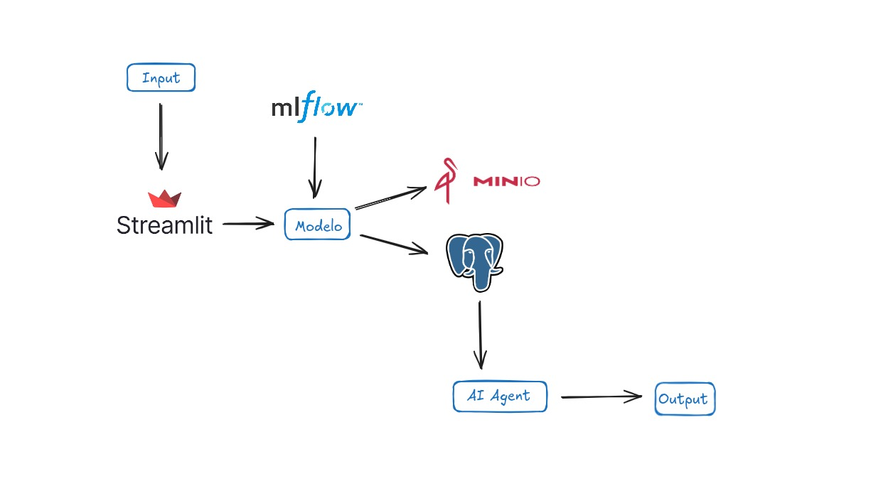

## Credit Risk 
A ideia é criar um ambiente para análise de inadimplência utilizando modelos de machine learning e técnicas de análise de dados
Modelos:

PD (Probability of Default)
EAD (Exposure at Default)
LGD (Loss Given Default)

Armazenamento de dados:

Banco de dados relacional Postgress

Bucket S3 (utilizando MinIO) para armazenamento de arquivos

Integração com ferramentas de BI:
Os dados armazenados podem ser utilizados posteriormente em ferramentas de Business Intelligence para fornecer análises detalhadas.

Atualmente, o projeto já conta com o modelo de PD, e os modelos de EAD e LGD estão em desenvolvimento.

